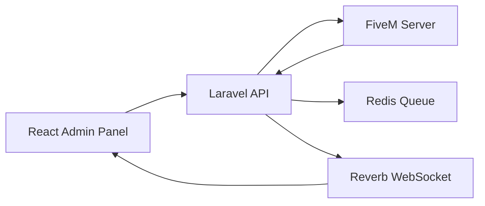

# NWL API

> Production-grade Laravel API for managing FiveM servers in a SaaS environment.

---

## 🐳 Quick Start

```bash
cp .env.example .env
docker compose up -d --build
docker compose exec app composer install
docker compose exec app php artisan key:generate
docker compose exec app php artisan migrate
```

API available at: BASE_URL/docs/api

---

## 🧠 Architecture Overview



### Key Concepts

- API-first backend
- Domain-driven structure
- Event-driven architecture
- Queue-based async processing
- Real-time broadcasting
- Tenant-aware workspaces and invitation onboarding

---

## 📦 Tech Stack

- PHP 8.4 / Laravel 13
- PostgreSQL
- Redis
- Sanctum (auth)
- Reverb (realtime)
- Pest (testing)
- PHPStan + Pint (quality)

---

## 🔐 Security Model

### Authentication

- Laravel Sanctum
- Token-based access
- API guards

### Authorization

- Policies (domain-level)
- Spatie Permissions (roles)
- Fine-grained access control

### API Protection

- Rate limiting
- HMAC for FiveM communication (planned)
- Input validation everywhere

---

## 🧱 Domain Structure

```
app/
├── Domain/
│   ├── Auth/
│   ├── Servers/
│   ├── Players/
│   ├── Moderation/
│   ├── GameBridge/
│   └── Shared/
```

### Rules

- Controllers = HTTP only
- Actions = business logic
- DTOs = structured data
- Policies = authorization
- Jobs = async work

---

## 🔌 FiveM Bridge (Design)

### Flow

1. API dispatches command
2. Stored in DB
3. Queued (Redis)
4. Sent to FiveM
5. Callback → API
6. Result persisted + broadcast

### Future

- HMAC signatures
- idempotency
- retries

---

## 📡 API Design

- Prefix: `/api/v1`
- JSON-only responses
- Resource-based responses
- Consistent error format

### Example response

```json
{
    "data": {},
    "meta": {},
    "errors": null
}
```

---

## 🧪 Testing Strategy

### Unit

- Services
- DTOs
- Security (HMAC)

### Feature

- API endpoints
- Policies
- Auth flows

### Integration

- Redis
- Queue
- Reverb
- FiveM callbacks

Run:

```bash
docker compose exec app php artisan test
```

---

## 📊 Observability

- Laravel Pulse → performance
- Logs → Laravel logging
- Audit logs → activitylog

---

## ⚡ Real-time (Reverb)

Use cases:

- player events
- moderation updates
- command results

---

## 🧹 Code Quality

```bash
docker compose exec app ./vendor/bin/pint
docker compose exec app ./vendor/bin/phpstan analyse
```

Rules:

- no business logic in controllers
- strong typing
- DTO everywhere
- no magic strings

---

## 🚀 Dev Workflow

```bash
git checkout -b feature/my-feature
git commit -m "feat(api): add player endpoint"
git push
```

---

## 📦 Deployment Strategy (future)

- Docker images
- CI/CD pipeline
- environment parity
- queue workers
- reverb process

---

## 📘 Documentation

- /docs/api (Scramble)
- OpenAPI JSON available
- [Repository Doc](./docs/README.md)
- [Tenant Invitation Onboarding](./docs/tenancy-invitations.md)

---

## 🌍 Localization

- English default
- Translation keys only
- No hardcoded strings

---

## 🧭 Roadmap

- [ ] FiveM secure bridge
- [ ] advanced moderation
- [ ] full audit UI
- [ ] multi-tenant scaling

---

## 🧠 Philosophy

> Clarity over cleverness
> Explicit over implicit
> Scalable from day one

---

## 📄 License

Internal / proprietary
