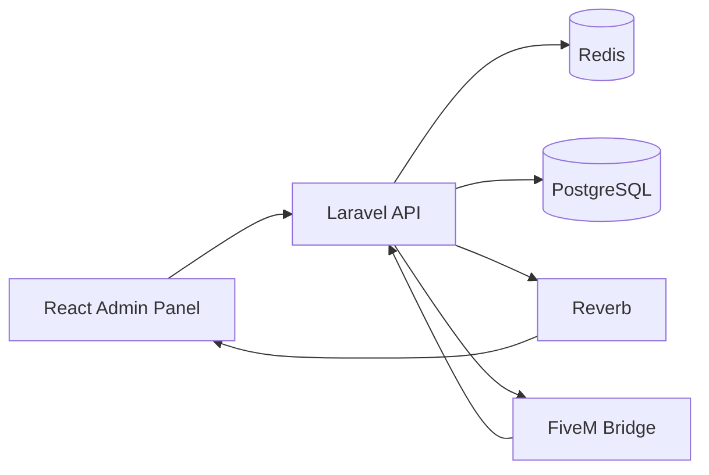

# Architecture

## System overview

NWL API is a Laravel backend for a SaaS platform that administrates FiveM servers.

The system is composed of three main parts:

1. React admin panel
2. Laravel API
3. FiveM module / game-side bridge

## High-level flow



## Design principles

- API-first design
- explicit contracts
- thin transport layer
- business logic in application actions
- authorization near the domain
- async processing for external execution
- auditability for staff actions
- localization-ready messages
- production-minded structure from day one

## Logical layers

### Transport layer

Contains:

- routes
- controllers
- requests
- resources
- middleware

Responsibilities:

- receive input
- validate transport-level structure
- delegate to application actions
- return standardized responses

### Application layer

Contains:

- actions
- jobs
- event handlers
- orchestration services

Responsibilities:

- execute business use cases
- coordinate persistence, logging, and side effects
- dispatch jobs and events

### Domain layer

Contains:

- models
- enums
- value objects
- policies
- domain events
- contracts

Responsibilities:

- express business meaning
- define rules and relationships
- remain explicit and testable

### Infrastructure layer

Contains:

- Redis integration
- database configuration
- broadcasting configuration
- FiveM transport integration
- logging channels
- external service adapters

Responsibilities:

- implement technical concerns
- remain replaceable where reasonable

## Suggested directory structure

```text
app/
├── Domain/
│   ├── Auth/
│   ├── AuditLogs/
│   ├── GameBridge/
│   ├── Moderation/
│   ├── Players/
│   ├── RolesPermissions/
│   ├── Servers/
│   ├── Tenancy/
│   └── Shared/
├── Http/
│   ├── Controllers/
│   │   └── Api/
│   │       └── V1/
│   ├── Middleware/
│   ├── Requests/
│   └── Resources/
├── Models/
├── Policies/
├── Providers/
└── Support/
```

## Runtime topology

The default development topology is Docker-based:

- `app` — PHP-FPM / application runtime
- `nginx` — HTTP entrypoint
- `postgres` — relational database
- `redis` — cache, queue, locks
- `queue` — worker process
- `reverb` — WebSocket process

## Why this structure

This project is not a basic CRUD API. It needs:

- multi-tenant awareness
- reliable staff authorization
- auditable moderation actions
- bridge communication with an external runtime
- async command execution
- realtime updates for the panel

A layered, explicit architecture is easier to scale than a controller-heavy Laravel structure.

## Change management

When a change affects:

- service boundaries
- trust boundaries
- runtime topology
- cross-cutting technical rules

create a new ADR in `docs/adr`.
